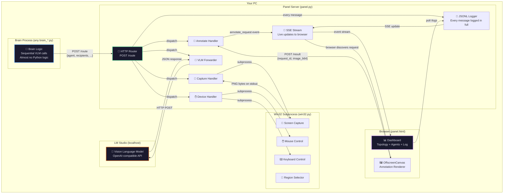
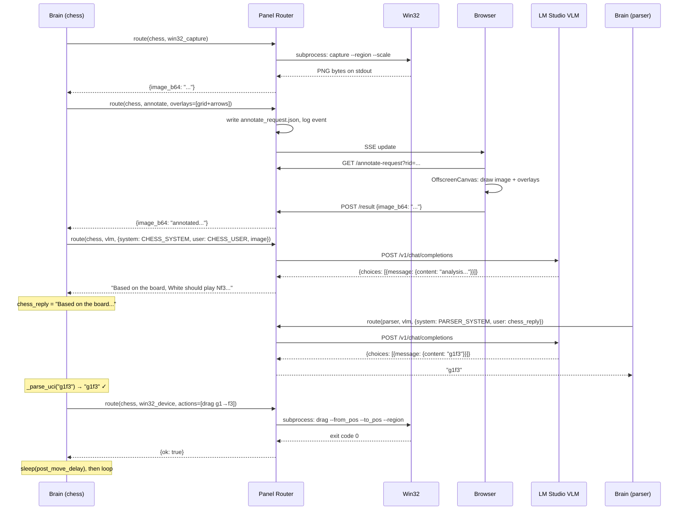
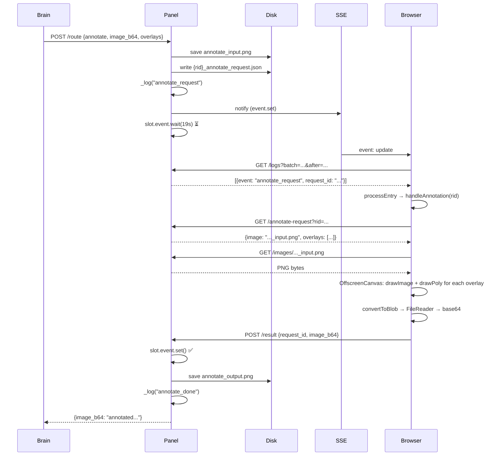
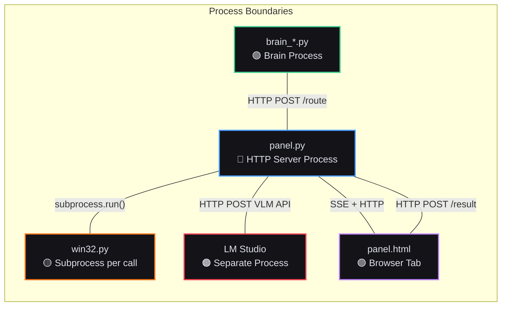
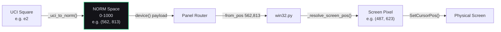

# Final Re-Evaluation + README.md

## Re-Evaluation Cross-Reference (New Codebase, All 5 Files)

After tracing all five files one more time against the logs and each other:

### Confirmed Issues Still Present

| ID | Issue | File(s) | Severity |
|----|-------|---------|----------|
| A | **Annotation always times out** — `handleAnnotation` catch(e){} silently swallows errors; browser never POSTs `/result` within 19s | panel.html JS `handleAnnotation`, panel.py `_handle_annotate` | Critical |
| B | **VLM sees raw unannotated image** — consequence of A; fallback `annotated_b64 = base_b64` at brain_chess_players.py means no grid/arrows | brain_chess_players.py | Critical |
| C | **Parser returns SAN not UCI** — "d4" is 2 chars, rejected by `_parse_uci`; parser VLM cannot convert SAN→UCI without board context | brain_chess_players.py PARSER prompts, `_parse_uci` | High |
| D | **chess_max_tokens=200 causes finish_reason=length every time** — VLM exhausts budget during piece enumeration, never states its move | brain_chess_players.py `ChessConfig.chess_max_tokens` | High |
| E | **`_vlm_params` match `None | False` also skips `0` and `0.0`** — Python match treats 0 as False; `presence_penalty=0.0` and `frequency_penalty=0.0` never sent | brain_util.py `_vlm_params` line ~42 | High |
| F | **`_handle_log` dead code** — route target "log" exists in panel.py but nothing in brain_util.py calls it | panel.py `_handle_log` | Low |
| G | **`NORM=1000` still defined in two places** — `SharedConfig.norm=1000` in brain_util.py and `Win32Constants.norm=1000` in win32.py; no shared import since win32.py is a subprocess | brain_util.py, win32.py | Medium |
| H | **interact.js CDN has no version pin** — uses bare path, could break on major version change | panel.html script import | Low |
| I | **Panel positions reset on page reload** — inline style initial positions, no localStorage persistence | panel.html | Low |
| J | **Replay mode fires handleAnnotation wastefully** — `isLive` check was added but need to verify SSE error path sets `isLive=false` correctly in replay (no SSE in replay → EventSource onerror fires → `isLive=false` ✓) | panel.html | Low (fixed) |

---

## README.md

````markdown
# Autonomous Agent Platform — VLM-Driven Computer Control

> A platform where vision-language models physically control a Windows 11 PC
> by looking at screenshots, thinking about what they see, and moving the mouse.
> Intelligence lives in VLM calls. Everything else is dumb plumbing.

---

## What This Is (For Non-Programmers)

Imagine you could sit a very smart robot in front of your computer, let it look at the screen
through a camera, think about what it sees, and then move the mouse and type on the keyboard
to accomplish tasks. That's what this project does — except the "robot" is a vision-language
model (a type of AI that understands images) running on your own PC.

The project is built like plumbing in a house:
- **Pipes** carry messages between components (the panel server)
- **Faucets** do physical actions on screen (the Win32 controller)
- **A window** shows you what's flowing through the pipes in real time (the dashboard)
- **Brains** are the smart parts that decide what to do (VLM calls)

The pipes don't care what flows through them. The faucets don't care who turned them on.
Each piece works independently. You can replace any brain with a completely different one —
chess, web browsing, form filling, game playing — and the plumbing just works.

---

## Architecture

### The Big Picture



### Chess Benchmark Flow (Two-Agent Sequential)



### Annotation Round-Trip Detail



### File Independence



**Every file is isolated by a process boundary.** They communicate only through HTTP or subprocess stdio. You can replace any one file without touching the others.

### Coordinate System



All coordinates pass through NORM-space (0-1000) as the universal language. The brain never knows screen resolution. Win32 never knows chess squares. The panel just passes numbers through.

---

## What We Changed (vs. Original Codebase)

### brain_util.py
| Change | Before | After | Why |
|--------|--------|-------|-----|
| Stop tokens | `VLMConfig.stop: tuple \| None = None` | Field removed entirely | No stop tokens anywhere in project |
| Config | Bare `NORM = 1000`, hardcoded `PANEL_URL` | `SharedConfig` frozen dataclass, `PANEL_URL` derived from config | Single source of truth |
| `_vlm_params` | `if v is not None` | `match v: case None \| False: pass` | Skips stream=False noise (⚠️ has 0.0 bug, see Known Issues) |
| `parse_brain_args` | if/elif chain | match/case | Pattern matching per coding rules |

### brain_chess_players.py
| Change | Before | After | Why |
|--------|--------|-------|-----|
| Agent architecture | chess + parser with parser system prompt injected into chess flow | Two clean agents: chess asks for analysis, parser receives chess reply as user message | Clean separation, parser prompt is standalone |
| Stop tokens | `stop=("\\n",)` on chess VLM call | Removed | VLM completes naturally |
| `/think` prompt | `CHESS_SYSTEM` ended with `/think\\` | Removed | Was conflicting with stop tokens; VLM thinks naturally now |
| `_parse_uci` | No `<think>` handling, no `=` handling | Strips `<think>` blocks via regex, strips `=` for promotions | Handles thinking models and promotion syntax |
| Exception handling | `except Exception: result = ""` (silent) | Still catches but sleeps `failure_delay` on failure | No tight spin loop |
| Token budget | `chess_max_tokens: 50` | `chess_max_tokens: 200` | More room for analysis (⚠️ still too low, see Known Issues) |
| Prompts | Single chess prompt + parser injected | 4 clean triple-quoted prompts: `CHESS_SYSTEM`, `CHESS_USER`, `PARSER_SYSTEM`, `PARSER_USER` | Clear, maintainable |

### panel.py
| Change | Before | After | Why |
|--------|--------|-------|-----|
| `_wait_html_ack` | Dead function (pass) | Removed | Dead code elimination |
| SSE keepalive | Magic `70.0` inline | `PanelConfig.sse_keepalive = 70.0` | No magic values |
| Log route | Not present | `_handle_log` + `case "log"` in dispatch | Future-proofing (currently unused) |

### panel.html
| Change | Before | After | Why |
|--------|--------|-------|-----|
| Layout | Rigid CSS Grid, fixed positions | `interact.js` draggable + resizable panels | User can arrange dashboard |
| Node boxes | Static absolute-positioned by ELK | Draggable with live wire rebuild | Interactive topology |
| `normalizeComp` | Dead logic (both branches return raw) | Removed | Dead code |
| Agent error states | Not handled | `capture_failed`, `annotate_timeout`, `vlm_error` update chip | Errors visible |
| Image viewing | No zoom | Click-to-enlarge fullscreen overlay | Inspect images at full resolution |
| Collapsible chips | Always expanded | Click header to toggle | Declutter |
| PCB aesthetic | Plain surface | Dot-grid background, SVG glow filter on signal dots | PCB metaphor |
| Replay safety | `handleAnnotation` fires in replay | Only fires when `isLive` is true | No wasteful re-rendering |
| interact.js | Not imported | CDN import, full drag/resize setup | Modern interactivity |

### win32.py
| Change | Before | After | Why |
|--------|--------|-------|-----|
| No changes | — | — | Already correct dumb plumbing |

---

## Known Issues (Current State)

### 🔴 Critical

**A. Annotation always times out.**
The browser's `handleAnnotation` function has `catch(e){}` that silently swallows all errors. If the OffscreenCanvas image load fails, the fetch chain breaks silently, and the panel's 19-second wait expires. Every single round falls back to sending the raw unannotated screenshot to the VLM. The VLM then has no grid overlay for coordinate reference.

*Root cause hypothesis:* Image fetch, OffscreenCanvas rendering, or base64 conversion fails silently inside the try/catch. Need to add error logging inside the catch block and verify the image URL resolves.

**B. VLM receives unannotated image.**
Direct consequence of A. Without the green grid overlay, the VLM cannot accurately map pieces to algebraic squares. It hallucinates positions (e.g., "King at g1 (bottom-left corner)" — g1 is not bottom-left). All subsequent reasoning is based on wrong positions.

### 🟡 High

**C. Parser returns SAN notation, not UCI.**
The parser VLM sometimes returns moves like "d4" (SAN — Standard Algebraic Notation, which is just the destination square). UCI notation requires source+destination (e.g., "d2d4"). The `_parse_uci` function correctly rejects "d4" because it's only 2 characters. But the parser has no way to convert SAN to UCI because it doesn't see the board — it only receives text. The parser prompt needs to be clearer that it must extract the FULL source→destination from the analysis text, not just the destination.

**D. chess_max_tokens=200 is too low.**
The chess prompt asks for step-by-step analysis identifying all pieces. With a small VLM (2-3B parameters), this easily exceeds 200 tokens. Every observed response has `finish_reason: "length"`, meaning the VLM was cut off mid-sentence. It never reaches stating its chosen move. The parser then has to guess from incomplete text.

**E. `_vlm_params` match statement skips 0 and 0.0.**
In Python, `match v: case None | False` also matches `0`, `0.0`, and `""` because `0 == False` is `True` in Python. This means `presence_penalty: 0.0` and `frequency_penalty: 0.0` are never included in the VLM request. LM Studio will use its own defaults, which may differ.

### 🟢 Medium / Low

**F. `_handle_log` is dead code.** Route target "log" exists in panel.py but nothing calls it.

**G. `NORM=1000` defined in two places.** `SharedConfig.norm=1000` in brain_util.py and `Win32Constants.norm=1000` in win32.py. They're in separate processes so can't share imports, but if either changes the other must too.

**H. interact.js CDN has no version pin.** Could break on major version change.

**I. Dashboard panel positions reset on page reload.** No localStorage persistence.

---

## Replay Feature

Every run is saved to `runs/<timestamp>/` with:
- `log_0000.jsonl`, `log_0001.jsonl`, ... — all events in full (zero truncation)
- `images/` — every captured screenshot, annotated input, annotated output, VLM input image

To replay a previous run:
```bash
python panel.py --replay runs/20250615_143012
```

This starts the panel server pointing at the saved run directory. Open the browser and you'll see the entire session reconstructed: the topology diagram builds up, agent chips fill with images and prompts, the event log scrolls through every message.

**Current replay limitations:**
- Annotation images from the original run display correctly (saved as PNGs in `/images/`)
- Browser does NOT re-render annotations in replay mode (`isLive=false` prevents `handleAnnotation` from firing)
- Panel positions reset to default (no saved layout state)

**Future replay improvements:**
- Playback speed control (step through events, pause, fast-forward)
- Timeline scrubber to jump to any point in the session
- Side-by-side comparison of two runs
- Export run as self-contained HTML archive
- Save and restore dashboard layout positions per run

---

## How to Run

```bash
# Prerequisites: Python 3.13, Windows 11, Chrome, LM Studio running on :1235

# Start the system with the chess benchmark brain:
python panel.py brain_chess_players.py

# The system will:
# 1. Ask you to select a screen region (drag to select the chess board)
# 2. Ask you to select a scale reference (drag horizontally for ~1000px reference)
# 3. Open Chrome with the dashboard
# 4. Launch the brain process
# 5. Begin the capture → annotate → VLM → parse → drag loop
```

---

## File Reference

| File | Lines | Purpose |
|------|-------|---------|
| `panel.py` | ~390 | HTTP router, JSONL logger, subprocess launcher, SSE, annotation slot mechanism |
| `panel.html` | ~560 | Dashboard: ELK topology, GSAP animations, interact.js drag/resize, OffscreenCanvas annotation |
| `brain_util.py` | ~140 | Brain developer SDK: route, capture, annotate, vlm_text, device, overlay, make_vlm_request |
| `brain_chess_players.py` | ~200 | Chess benchmark: two-agent flow (chess analysis → parser extraction → drag) |
| `win32.py` | ~530 | Win32 ctypes: screen capture, mouse, keyboard, region selector |

---

## Writing a New Brain

A brain is a Python script that imports `brain_util` and calls its functions in a loop:

```python
import brain_util as bu

args = bu.parse_brain_args(sys.argv[1:])

while True:
    # 1. See the screen
    image = bu.capture("my_agent", args.region, scale=args.scale)

    # 2. Think about it (ask VLM)
    reply = bu.vlm_text("my_agent", bu.make_vlm_request(
        system_prompt="You are...",
        user_text="What do you see?",
        image_b64=image,
    ))

    # 3. Do something (mouse/keyboard)
    bu.device("my_agent", args.region, [
        {"type": "click", "x": 500, "y": 500}
    ])
```

That's it. The panel handles all logging, the browser handles visualization, win32.py handles the physical actions. Your brain just thinks.

---

## Claude Opus 4.6 Analysis Prompt

The following prompt is designed for use in a fresh Claude conversation with zero history.
It works with any single file or all five files. Send the prompt first, then send files
one by one (panel.html as base64 is fine — decode it first).

<details>
<summary><strong>Click to expand the full analysis prompt</strong></summary>

```
You are auditing a non-standard autonomous agent platform for Windows 11.
This is NOT a web app, API, or chatbot. It is a system where VLMs (vision-
language models running in LM Studio on localhost) physically control a PC
by seeing screenshots and issuing mouse/keyboard actions through dumb plumbing.

WAIT for all files before analyzing. Confirm receipt of each file. If a file
arrives as base64, decode it first. You may receive 1-5 files — analyze
whatever you get, but note what's missing.

The 5 files (all independent, process-isolated):
  panel.py        — HTTP router + sole JSONL logger + subprocess launcher
  panel.html      — Browser dashboard + OffscreenCanvas annotation renderer
  brain_util.py   — Brain developer SDK (route, capture, annotate, vlm_text, device)
  brain_*.py      — Any brain (chess is the benchmark, others may exist)
  win32.py        — Win32 ctypes subprocess (capture, mouse, keyboard)

COMMUNICATION PROTOCOLS:
  brain → panel:    HTTP POST /route {agent, recipients:[target], ...payload}
  panel → win32:    subprocess.run([python, win32.py, command, --args])
  panel → VLM:      HTTP POST to localhost LM Studio (OpenAI-compatible)
  panel → browser:  SSE event stream at /events
  browser → panel:  HTTP GET /logs (polling), POST /result (annotation return)
  panel → disk:     JSONL log files + PNG images in runs/<timestamp>/

ANNOTATION ROUND-TRIP (the non-obvious part):
  Brain calls annotate() → panel writes request JSON to disk, logs
  annotate_request event, waits on threading.Event for 19s → SSE notifies
  browser → browser polls /logs, discovers annotate_request, fetches the
  request JSON, loads image, composites overlay polygons via OffscreenCanvas,
  converts to base64, POSTs to /result → panel unblocks, returns to brain.
  If browser doesn't complete in 19s → timeout → brain falls back to raw image.

COORDINATE SYSTEM:
  All coordinates in NORM-space (0-1000). Brain computes NORM coords, sends
  to panel, panel templates them as --from_pos/--to_pos args, win32.py maps
  to screen pixels via region. NORM=1000 defined in both brain_util.SharedConfig
  and win32.Win32Constants (separate processes, can't share import).

REPLAY FEATURE:
  python panel.py --replay <run_dir> serves saved JSONL logs + images.
  Browser reconstructs the session from log entries. No live annotation in
  replay (isLive=false). All images were saved during live run.

CODING RULES (the code aims to follow these):
  • Python 3.13, Windows 11, latest Chrome only. No legacy.
  • Strict typing. Frozen dataclasses for config. Pattern matching.
  • No comments in code files. No stop tokens. No magic values outside
    frozen dataclasses. No duplicate flows. Zero data truncation.
  • VLM prompts as triple-quoted module-level strings.
  • HTML: dark PCB aesthetic, interact.js, ELK, GSAP. No CSS frameworks.
  • Panel is sole logger. Brains import brain_util only.

LOG FILE ANALYSIS (if logs are provided):
  Logs are JSONL with: ts, event, from, to, agent, request_id, label,
  error, finish_reason, duration, tokens, image, fields{...}.
  Key events to trace: route → capture_done → annotate_request →
  annotate_timeout OR annotate_done → vlm_forward → vlm_response →
  action_dispatch → device_done.
  Look for: annotate_timeout (annotation broken), finish_reason:"length"
  (token budget too low), parser returning non-UCI strings, error:true
  on any event, gaps in timing suggesting hangs.

ANALYSIS METHOD:
  1. Map every function, route, event listener, subprocess call, dataclass.
  2. Trace data flow for each route target end-to-end.
  3. If logs provided: cross-reference log events with code paths.
  4. Check annotation round-trip for timing/error issues.
  5. Check _parse_uci against realistic VLM outputs.
  6. Check _vlm_params for correct value handling (0, 0.0, None, False).
  7. Check coordinate pipeline NORM consistency.
  8. Verify zero-truncation in logs, HTTP responses, and HTML display.
  9. Audit against coding rules. Flag violations with line numbers.
  10. Produce severity-rated issue table with one-line fixes.

Cite exact file:line and quote code for every claim.
```

</details>

---

## License

This project is experimental research software. Use at your own risk.
It will move your mouse and type on your keyboard.
````